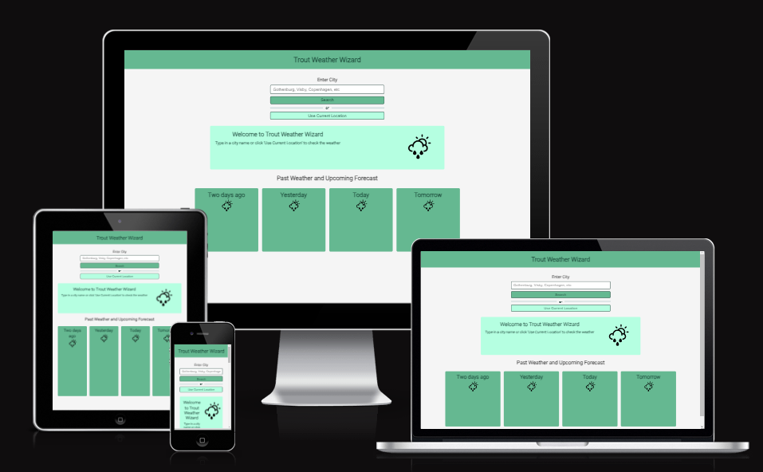
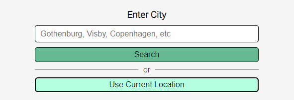
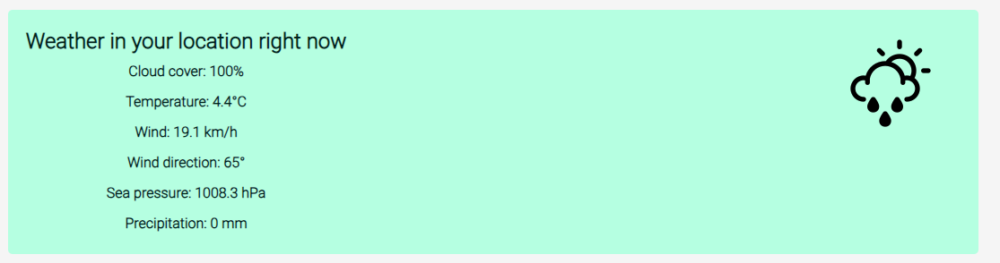
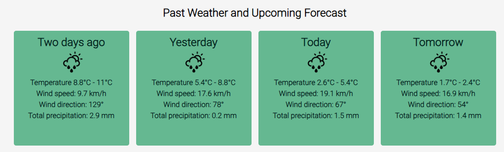
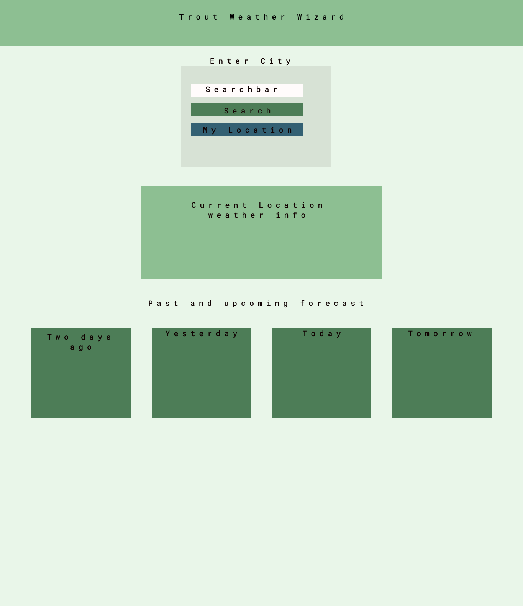
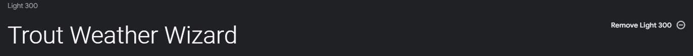
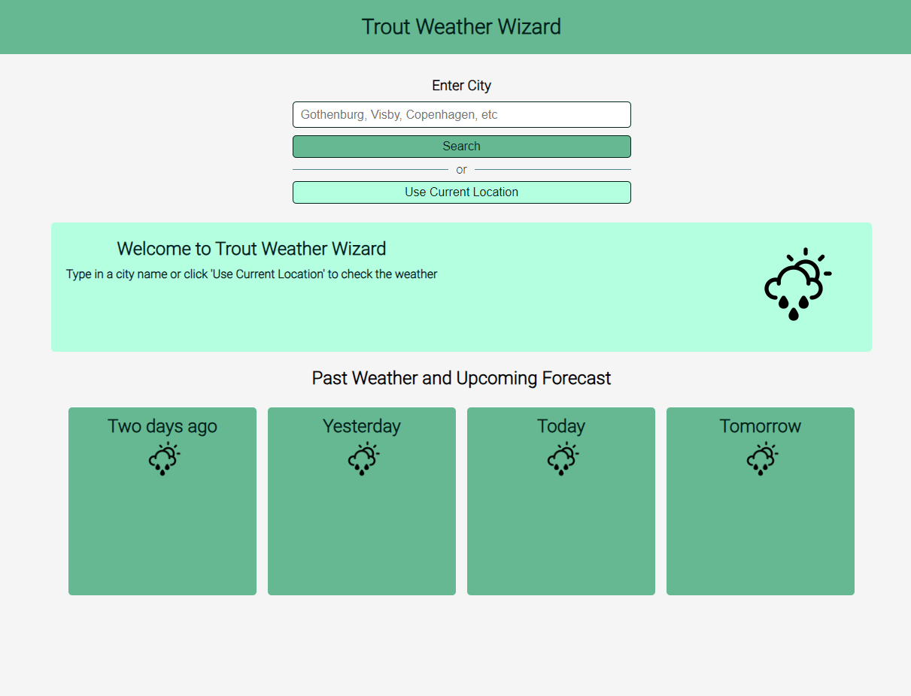
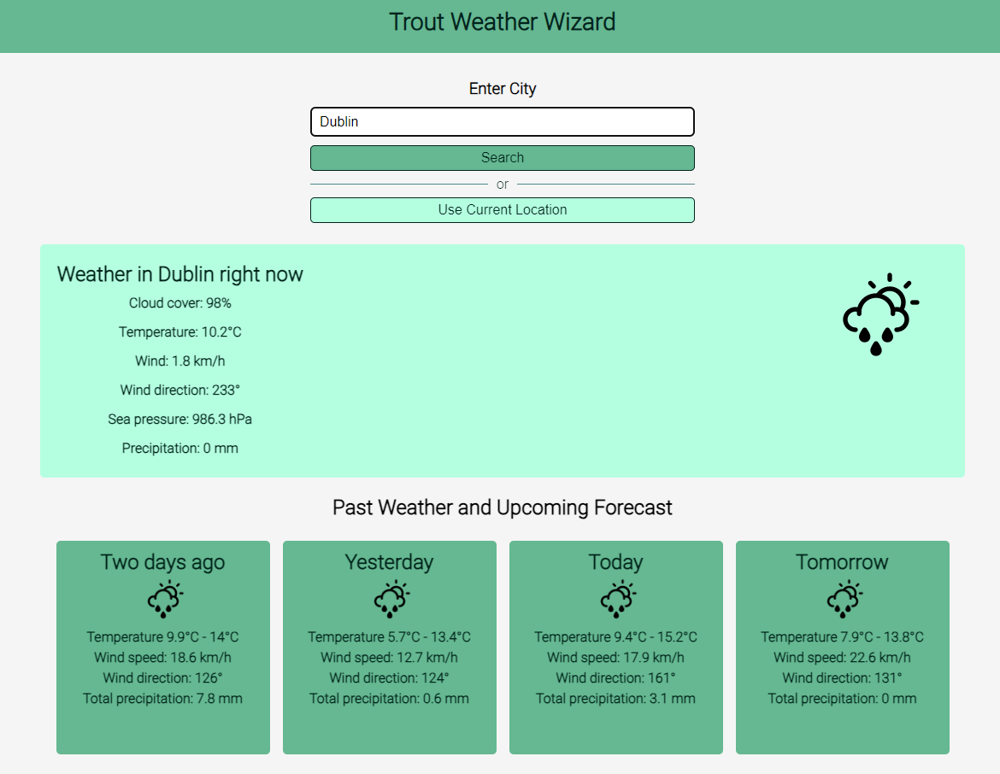
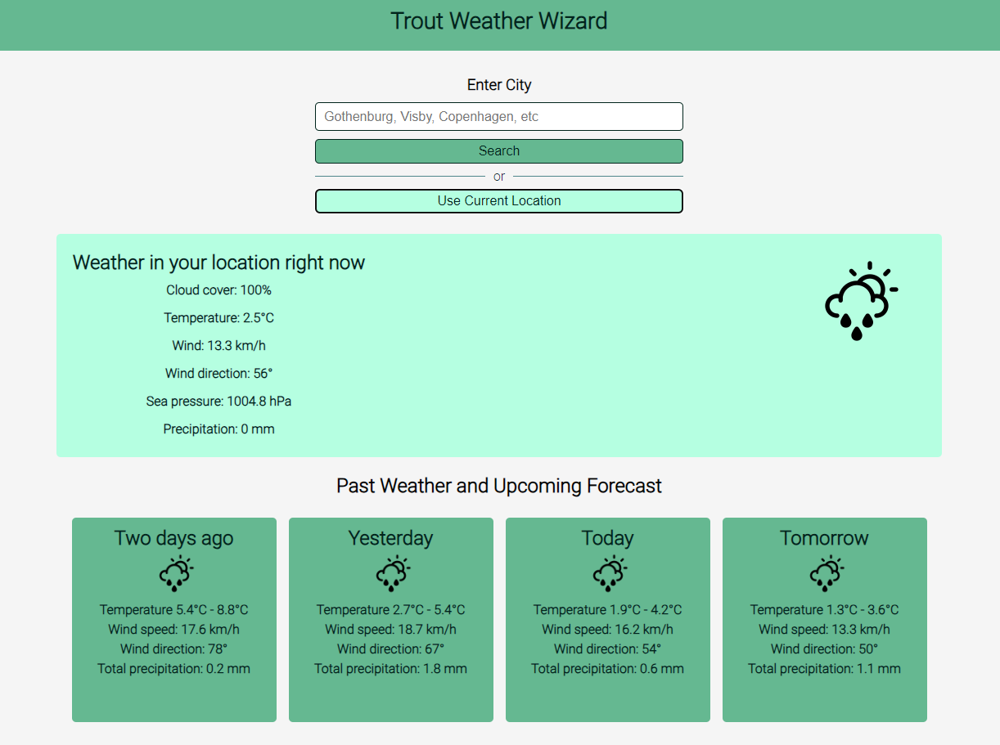

# Trout Weather Wizard

[Visit website here](https://alexelbert.github.io/trout-weather-wizard/)

Created to easily provide weather information that are useful for sport fishing, especially when targeting trout. The information provides both past end present weather data that would be helpful in a sport fisherman's search for especially sea trout, but also different species. This website was made for educational purposes only.

Website is made up of following sections:

- A search section, to input either city or option to use your current location.
- A current weather section, it retrieves the current weather information.
- A forecast of past two days, today and tomorrows summary of weather information.

The business goals for the website are:

1. Make weather information from past and present easily accessible.
2. Provide a useful tool for both the avid and average sport fisherman.
3. Earn commission by charging a small fee for usage, commercial adds and referrals through online tackle shops for example.

User goals for this website are:

1. As a first-time visitor, I want to easily find useful information about past present and estimated future weather.
2. As a first-time visitor, I want to have access to many locations by my own choice or my current location. 
4. As a recurring or first-time visitor, I want the essential information available just a few clicks away.

## UX

### Strategy

Taking into consideration the core UX principles made me first think of who my target audience is and what features and technologies to implement.

Trout Weather Wizard target users are:

- Age, 10-60
- Has an interest in sport fishing
- Interested in having a helpful tool to decide when your spot would have a higher chance to provide good results.

What these users would be looking for:

- Users are looking for a website that is easy to navigate and provides information in a clear and concise manner. They want a user-friendly interface that doesn't require a lot of effort to find the information they need
- Users expect the information to be accurate and up-to-date. A reliable weather source is crucial for making important decisions related to fishing, travel, and more.
- Users want a quick way to access weather information. They don't want to spend a lot of time searching for or waiting for the data to load.

The Trout Weather Wizard website provides a user-friendly experience for visitors, with focus on delivering essential weather information quickly. With a responsive design optimized for mobile devices, it caters to users on the go.

### Scope

The following features will be included in the release to achieve the user and business goals:

- Header that conveys an easy explanation to the website
- Search section with placeholder text for explaining quickly what to input to the user
- Current weather section that coveys what kind of information you will receive with help of text and image weather icon
- Past, current and upcoming forecast in form of weather cards

### Structure

This is a one page simple website that facilitates the user weather information. Current weather measuring wind speed and direction. Barometric pressure above sea level, cloud coverage and precipitation. Past days, today and tomorrows weather in form of temperature, wind speed, wind direction and total precipitation. All weather information easily accessible though the input search function or using the users location at the top of the page.

### Skeleton

The website is slightly different from the initial wireframes. In the final version I made some changes to colour and font otherwise it quite similar to the initial concept.

### Surface

The choice for the colour palette is based around marine green colours with notes some blue notes in the darker greens which reminds you of the ocean and the vegetation underneath its surface. I choose three different shades of green, off white almost shell like colour for the main background with a almost black text for a clear read.

I used Google fonts 'Roboto' for the website, used a light 300 since it's easy to read and fit the minimal theme of the website.

## Features

This website is fully responsive across all screens with a clean user friendly UI, with weather icons that are visually pleasing. Quick search to get current, past and future weather information. Text and colours are consistent through the design of the website. 

### Current Weather Information 

View real-time weather data for any city, get details on cloud coverage, tempetarture, wind speed, wind direction, sea pressure and precipitation.

### 2-Day Past and 2-day Future Forecast

Access a two day past and future weather forecast to compare past and future weather conditions for a comprehensive overview. Makes it easy to plan ahead for your next fishing trip or your next hiking trip for that matter, by giving you a holistic view of the weather trends.

### Search By City Name

Simply type in your desired city and this website accurate geocoding feature will fetch the necessary coordinates to deliver precise weather data. 

### User Location Weather Info

Let the website access your current location via the browsers geolocation. Receive real time weather data that is tailored to your precise whereabouts. 

## Technologies Used

The following technologies has been used to make this website work:

- [HTML](https://developer.mozilla.org/en-US/docs/Web/HTML)
    - Basic building block and structure of the content used for the project.
- [CSS](https://developer.mozilla.org/en-US/docs/Learn/Getting_started_with_the_web/CSS_basics)
    - Used for styling all the content of the website.
- [JavaScript](https://developer.mozilla.org/en-US/docs/Web/JavaScript)
    - Used for all responsive content of the website, fetching the API and displaying the weather data. 
- [Iconfinder](https://www.iconfinder.com/)
    - Used to acquire weather icons.
- [Google Fonts](https://fonts.google.com/)
    - Used to obtain the fonts used across the website.
- [Dev.Opera](https://dev.opera.com/extensions/dev-tools/)
    - Used as a method of testing responsiveness and other issues/bugs with spacing and bugs.
- [GitHub](https://github.com/)
    - Used for storing pushed code.
- [Git](https://git-scm.com/)
    - Used to track changes in the code through  terminal commits and pushing from VS Code to GitHub. 
- [Visual Studio Code](https://code.visualstudio.com)
    - Used as a code editor.
- [Figma](https://figma.com/)
    - Used for creating wireframes to the project.
- [Code Spell Checker](https://marketplace.visualstudio.com/items?itemName=streetsidesoftware.code-spell-checker)
    - Extension software used to fix spelling errors across the project.
- [JsHint](https://jshint.com/)
    - Used to check that the Javascript source code is compliant with the standards.   
- [W3C Markup Validation Service](https://validator.w3.org)
    - Used to validate HTML code.
- [W3C CSS Validation Service](https://jigsaw.w3.org/css-validator/)
    - Used to validate CSS code.
- [Am I Responsive](http://ami.responsivedesign.is/)
    - Used to make responsive image for README.md file.
- [PageSpeed Insigts](https://pagespeed.web.dev)
    - Used to assess performance of the website.
- [Open-Meteo](https://open-meteo.com/)
    - Used their free API for the website.

## Testing

### User Stories
1. **As a first-time visitor, I want to easily find useful information about past present and estimated future weather.**
As soon as the page opens you can find clear information from the name of the website and clear instructions in form of placeholder text in the search box and labelled buttons. The current weather section is displaying a welcome message and some further instructions on how to use the website.

2. **As a first-time visitor, I want to have access to many locations by my own choice or my current location.**
To access weather information for your chosen location, simply use the search bar and type in the name of the city you're interested in. It's quick and easy to get the data you need.
But what's even more convenient is the option to check the weather for your current location. Just click on the "Use My Current Location" button, and the website will automatically fetch weather data for where you are right now.

4. **As a recurring or first-time visitor, I want the essential information available just a few clicks away.**
To access current weather information or a 4 day forecast, you're just one click away form the details you seek. The design of the layout is made to minimize unnecessary clicks to make the users journey to the weather information as straightforward as possible whether you are a first-time visitor or a recurring one. 